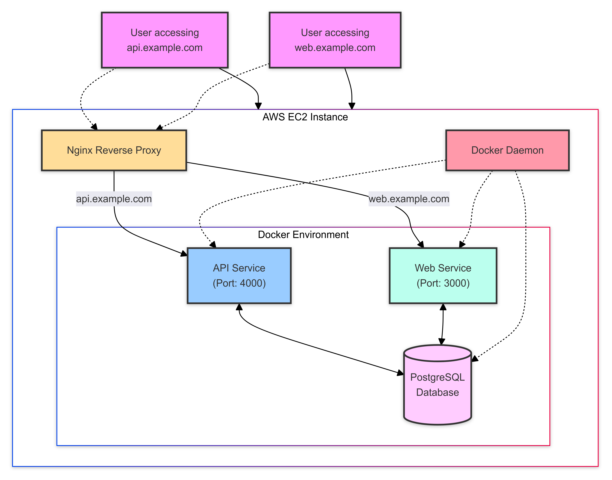

# 🚀 Cloud-Native Multi-Service Deployment

## 🌟 Overview

Welcome to our cloud-native multi-service deployment project! This repository contains everything you need to set up a robust, scalable web infrastructure on AWS using Docker, Nginx, and modern DevOps practices.



## 🗂️ Repository Contents

- `server_setup.sh`: Initial server configuration script
- `Dockerfile.api`: Dockerfile for the API service
- `Dockerfile.web`: Dockerfile for the Web service
- `docker-compose.yml`: Docker Compose configuration
- `nginx.conf`: Nginx reverse proxy configuration
- `update_content.sh`: Automated content update script

## 🛠️ Setup Instructions

### 1. Launch EC2 Instance
- Use Amazon Linux 2 AMI
- Configure security groups for ports 22, 80, 443

### 2. Initial Server Setup
```bash
chmod +x server_setup.sh
./server_setup.sh
```

### 3. Clone Repository
```bash
git clone https://github.com/yourusername/your-repo-name.git
cd your-repo-name
```

### 4. Docker Setup
```bash
docker-compose up -d
```

### 5. Nginx Configuration
```bash
sudo cp nginx.conf /etc/nginx/sites-available/default
sudo nginx -t
sudo systemctl reload nginx
```

## 🔄 Automated Updates

To set up daily content updates:

1. Make the script executable:
   ```bash
   chmod +x update_content.sh
   ```

2. Add to crontab:
   ```bash
   crontab -e
   ```
   Add the following line:
   ```
   0 2 * * * /path/to/update_content.sh >> /path/to/update_log.txt 2>&1
   ```

## 🌐 Accessing the Services

- API: http://api.example.com
- Web: http://web.example.com

## 🔧 Troubleshooting

Check out our [Troubleshooting Guide](./TROUBLESHOOTING.md) for common issues and solutions.

## 📊 Monitoring

We recommend setting up CloudWatch for monitoring. Basic setup instructions:

1. Install CloudWatch agent
2. Configure metrics collection
3. Set up alarms for critical thresholds

## 🚀 Scaling

To scale the services:

1. Adjust `docker-compose.yml` to increase replicas
2. Consider using AWS ECS for more advanced scaling


---

Built with ❤️ by [Your Name/Team]

```

This README provides a comprehensive overview of your project, including:

1. A brief introduction and architecture diagram
2. List of key files in the repository
3. Detailed setup instructions
4. Information on automated updates
5. How to access the services
6. Links to troubleshooting and contribution guides
7. Basic info on monitoring and scaling
8. License information

You can further customize this README by:
- Adding badges (e.g., build status, version)
- Including more detailed configuration options
- Adding a section on project roadmap or future features
- Providing contact information or links to related projects

Remember to create the referenced files (TROUBLESHOOTING.md, CONTRIBUTING.md, LICENSE) and add your actual architecture diagram image to make the README complete and fully functional.
